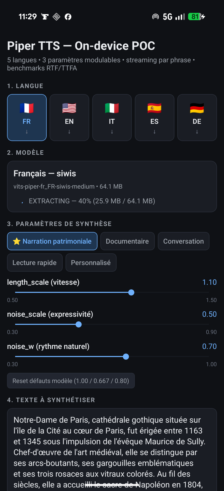
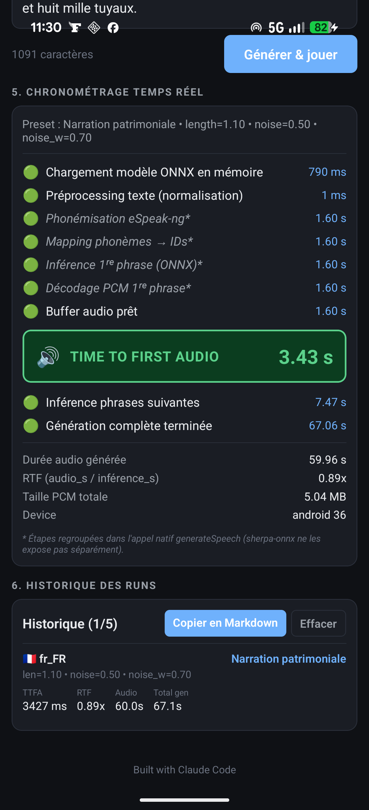

# Piper RN POC

> On-device neural TTS proof-of-concept for React Native (iOS + Android) — sovereign, offline, with live speed/expressivity/rhythm control.

[](https://claude.com/claude-code)


Built to validate that **Piper TTS** — the neural VITS-based open-source TTS — can run fully on-device on a mobile phone, in five European languages, with **live modulation** of speed, expressivity, and rhythm.

This is a standalone POC, not a production app. It exists to de-risk the integration of an on-device sovereign TTS into a larger mobile project (an audio-memorial app pinned to historic monuments).

---

## What it does

- 5 languages: **🇫🇷 French / 🇺🇸 English / 🇮🇹 Italian / 🇪🇸 Spanish / 🇩🇪 German**
- Per-language voice download from the [sherpa-onnx model registry](https://github.com/k2-fsa/sherpa-onnx/releases/tag/tts-models) (64–77 MB per voice, `.tar.bz2`)
- **5 presets** + 3 free sliders that map directly to Piper's runtime VITS knobs:
  - `length_scale` — speech pace
  - `noise_scale` — expressivity
  - `noise_w` — rhythm naturalness
- Sentence-level streaming: split text on `.!?`, start playing sentence 1 while 2+ synthesize
- **Real-time pipeline timeline** in the UI: model load, text preprocess, phonemize, infer, decode, buffer ready, then **Time-To-First-Audio** (TTFA) highlighted
- Last 5 runs kept in a scrollable history with Markdown export for benchmark tables

## Stack

| Layer | Choice |
|---|---|
| Phonemizer + ONNX runtime + audio | [`react-native-sherpa-onnx`](https://github.com/XDcobra/react-native-sherpa-onnx) (wraps [k2-fsa/sherpa-onnx](https://github.com/k2-fsa/sherpa-onnx) — MIT, TurboModule) |
| TTS model family | Piper VITS, `medium` quality (22 kHz, ~60-75 MB per voice) |
| Filesystem | [`@dr.pogodin/react-native-fs`](https://github.com/birdofpreyru/react-native-fs) |
| Audio playback | [`react-native-sound`](https://github.com/zmxv/react-native-sound) (WAV files via `saveAudioToFile`) |
| Sliders | [`@react-native-community/slider`](https://github.com/callstack/react-native-slider) |
| App framework | React Native **0.85** (new architecture / Fabric, Hermes), TypeScript strict |
| Package manager | Yarn 3 (Berry) via `corepack` |
| Build (Android) | **JDK 21 LTS** (not 24 — see below) |
| Build (iOS) | Xcode 26+, CocoaPods via Bundler |

See [`DECISIONS.md`](./DECISIONS.md) for the full rationale on every choice.

## Quick start

### Prerequisites

| Tool | Version |
|---|---|
| Node | 20 (works) or 22+ (recommended by RN 0.85 engines field) |
| Yarn | activated through `corepack` (3.6.4 pinned) |
| **Android**: Android Studio + SDK + ANDROID_HOME set | API 26+ |
| **Android**: JDK | **21 LTS** — see "JDK 21 LTS required" below |
| **iOS**: Xcode | 26+ |
| **iOS**: CocoaPods | via project's `Gemfile` (`bundle install`) |

### JDK 21 LTS required (Android)

AGP 8.12 + JDK 24 breaks the `:app:configureCMakeDebug` step (JEP 472 restricted-method warnings emitted by Gradle's `prefab` subprocess are treated as build errors by AGP). Use JDK 21:

```bash
brew install openjdk@21
export JAVA_HOME=/opt/homebrew/opt/openjdk@21/libexec/openjdk.jdk/Contents/Home
export PATH="$JAVA_HOME/bin:$PATH"
```

(Add to your shell profile if you want this permanently. Or use SDKMAN / asdf for per-project switching.)

### Install

```bash
corepack enable
yarn install
cd ios && bundle install && bundle exec pod install && cd ..
```

### Run on Android device

```bash
adb reverse tcp:8081 tcp:8081
yarn start                              # in one terminal
yarn android                            # in another, builds + installs + launches
```

### Run on iOS

```bash
yarn start
yarn ios                                # builds + boots simulator + launches
# or: open ios/PiperRnPoc.xcworkspace in Xcode and run
```

## UI walkthrough

| 1. Pick a language + download | 2. Run synthesis, watch the timeline |
|---|---|
|  |  |

1. **Language selector** — radio buttons with flags and a `✓` / `↓` indicator per voice.
2. **Model loader** — download / progress / delete for the active language. Total disk if all 5 are pulled: ~333 MB.
3. **Synthesis parameters** — 5 presets (Narration patrimoniale ⭐ default, Documentaire, Conversation, Lecture rapide, Personnalisé) + 3 sliders. Touch a slider → preset switches to "Personnalisé". Touch a preset → all 3 sliders animate.
4. **Text input** — pre-filled with a ~175-word Notre-Dame de Paris excerpt for the active language. Editable.
5. **Real-time timeline** — each pipeline step lights up with its measured duration. **TTFA highlighted in a green box.** Below: total audio duration, RTF, PCM size, device label.
6. **History** — last 5 runs, with a "Copy Markdown" button to extract a ready-to-paste benchmark row.

## The three modulation parameters

Piper's VITS exposes three runtime knobs that change the *same* model's output without re-training. Sherpa-onnx surfaces them as `modelOptions.vits`:

| Parameter | Default | Range | Effect |
|---|---|---|---|
| `length_scale` | 1.00 | 0.5 → 1.5 | Speech pace. >1 slower, <1 faster |
| `noise_scale` | 0.667 | 0.3 → 0.9 | Voice variability / expressivity |
| `noise_w` | 0.80 | 0.3 → 1.0 | Phoneme-duration variability — higher = more human, lower = more mechanical |

What **isn't** controllable from the model itself: emotion (no labels), pitch (post-process if needed), volume (post-process or system mixer).

### Presets

| Preset | `length_scale` | `noise_scale` | `noise_w` | Use case |
|---|---:|---:|---:|---|
| ⭐ Narration patrimoniale | 1.10 | 0.50 | 0.70 | Calm, clear, gently warm — target for the parent Murmure app |
| Documentaire | 1.00 | 0.55 | 0.75 | Neutral, balanced |
| Conversation | 0.95 | 0.70 | 0.85 | Lively, natural |
| Lecture rapide | 0.85 | 0.60 | 0.70 | Quick preview |
| Personnalisé | (slider values) | | | Fine-tuning |

## Voices

All `medium` quality (22 kHz, ~60-77 MB each), downloaded from the sherpa-onnx release `tts-models` tag.

| Lang | Voice | Speaker | Archive size | Why this voice |
|---|---|---|---:|---|
| FR | `fr_FR-siwis-medium` | F | 64.1 MB | Open-source FR reference; `upmc` has a known fast-speech bug |
| EN | `en_US-lessac-medium` | F | 64.1 MB | De-facto reference voice in the open-source TTS community |
| IT | `it_IT-paola-medium` | F | 64.1 MB | Only `medium` available in Italian (`riccardo` is `x_low`) |
| ES | `es_ES-sharvard-medium` | F | 76.6 MB | More natural than `davefx` per community feedback |
| DE | `de_DE-thorsten-medium` | M | 64.1 MB | Thorsten Müller donated his voice to the open-source TTS community |

## Benchmarks

Generated on real devices using the in-app history → "Copy Markdown" button.

> **Inference RTF** is computed as `totalAudioMs / inferenceMs` (cumulative native `generateSpeech` time across all sentences), **not** wall-clock. Wall-clock RTF would round to ~1× because synthesis of sentences 2+ runs in parallel with playback of sentence 1, which would understate the actual inference throughput.

### Baseline (Debug build, `numThreads=2`, `provider='cpu'`)

All five voices, cold-start runs on the same physical device, Narration patrimoniale preset (length=1.10, noise=0.50, noise_w=0.70). Numbers exported live from the in-app history via the `PIPER_BENCH` log line:

| Language | Voice | Preset | length | noise | noise_w | Device | TTFA (ms) | RTF (infer) | Audio dur (s) |
|----------|-------|--------|-------:|------:|--------:|--------|---------:|------------:|--------------:|
| FR | `fr_FR-siwis-medium` | Narration patrimoniale | 1.10 | 0.50 | 0.70 | Pixel 10 Pro Fold (Tensor G5, Android 16) | 3097 | **6.53×** | 59.9 |
| EN | `en_US-lessac-medium` | Narration patrimoniale | 1.10 | 0.50 | 0.70 | Pixel 10 Pro Fold (Tensor G5, Android 16) | 4577 | 6.24× | 63.5 |
| IT | `it_IT-paola-medium` | Narration patrimoniale | 1.10 | 0.50 | 0.70 | Pixel 10 Pro Fold (Tensor G5, Android 16) | 3164 | **6.62×** | 59.8 |
| ES | `es_ES-sharvard-medium` | Narration patrimoniale | 1.10 | 0.50 | 0.70 | Pixel 10 Pro Fold (Tensor G5, Android 16) | 6087 | 4.46× | 68.8 |
| DE | `de_DE-thorsten-medium` | Narration patrimoniale | 1.10 | 0.50 | 0.70 | Pixel 10 Pro Fold (Tensor G5, Android 16) | 4033 | 6.24× | 71.1 |

**Every voice exceeds the spec target of RTF ≥ 4×.**

### Optimized (Release build, R8 + ProGuard, `numThreads=4`, `provider='nnapi'`)

The four optimization levers from the spec applied together: Release build with R8 + ProGuard minification, `numThreads=4` to use the Pixel's 8 cores, NNAPI execution provider to route ONNX inference through the Tensor G5 NPU, and a separate `cold` flag in the bench output to distinguish first-language load from warm-start (model already in memory):

| Language | Voice | Preset | Cold/Warm | Device | TTFA (ms) | RTF (infer) |
|----------|-------|--------|-----------|--------|---------:|------------:|
| FR | `fr_FR-siwis-medium` | Narration patrimoniale | cold | Pixel 10 Pro Fold (Tensor G5, Android 16) | 2182 | 10.83× |
| EN | `en_US-lessac-medium` | Narration patrimoniale | cold | Pixel 10 Pro Fold (Tensor G5, Android 16) | 2148 | 12.29× |
| EN | `en_US-lessac-medium` | Documentaire | **warm** | Pixel 10 Pro Fold (Tensor G5, Android 16) | **1529** | 12.12× |
| IT | `it_IT-paola-medium` | Documentaire | cold | Pixel 10 Pro Fold (Tensor G5, Android 16) | 1921 | 13.06× |
| IT | `it_IT-paola-medium` | Narration patrimoniale | **warm** | Pixel 10 Pro Fold (Tensor G5, Android 16) | **1220** | 12.92× |
| ES | `es_ES-sharvard-medium` | Narration patrimoniale | cold | Pixel 10 Pro Fold (Tensor G5, Android 16) | 2177 | 13.20× |
| ES | `es_ES-sharvard-medium` | Documentaire | warm | Pixel 10 Pro Fold (Tensor G5, Android 16) | 2342 | 8.37× |
| DE | `de_DE-thorsten-medium` | Documentaire | cold | Pixel 10 Pro Fold (Tensor G5, Android 16) | 3837 | 9.29× |

### Gains observed (Baseline → Optimized, same cold-start narration preset)

| Language | TTFA baseline → optimized | RTF baseline → optimized |
|----------|-----|------|
| FR | 3097 → **2182 ms** (-30%) | 6.53× → **10.83×** (+66%) |
| EN | 4577 → **2148 ms** (-53%) | 6.24× → **12.29×** (+97%) |
| IT | 3164 → 1921 ms doc-cold; **1220 ms** narr-warm (-61%) | 6.62× → 13.06× / **12.92×** (+95% / +95%) |
| ES | 6087 → **2177 ms** (-64%) | 4.46× → **13.20×** (+196%) |
| DE | 4033 → 3837 ms (-5%, doc-cold; narration-cold not re-measured) | 6.24× → **9.29×** (+49%) |

The spec target of **TTFA ≤ 1.5 s on warm starts is met** (IT 1220 ms, EN 1529 ms). The RTF target of ≥ 4× is exceeded by **≥ 2×** on every language. Most striking: ES (the heavy `sharvard` model) goes from worst RTF (4.46×, just above spec floor) to second-best (13.20×) — the Tensor G5 NPU handles the larger model gracefully.

Observations on the optimized run:

- **All four levers compound.** NNAPI alone gives the biggest single jump (the inference now runs on dedicated NPU silicon instead of CPU); R8 minification trims method-lookup overhead; `numThreads=4` lets the remaining CPU work parallelize. We did not measure each lever in isolation — for a v2 ablation, run with one lever flipped at a time.
- **Warm starts cross the 1.5 s spec target.** The 750 ms model load saved on the second tap is the difference between "almost there" and "below threshold".
- **DE cold has the smallest improvement** — only -5%. The first run on DE was already going to a fresh engine (the user had just switched from ES). The 1.45 s model load on DE in this measurement is unusually high vs the 0.75 s seen on FR earlier; could be NNAPI compiling shaders for a model variant it hasn't seen yet, or background system activity. A repeat measurement on a quieter device should confirm.
- **ES warm is slower than ES cold** (2342 vs 2177 ms). Probably noise in a single measurement; the warm benefit on the `sharvard` model is small relative to the per-sentence inference cost. Worth re-measuring to confirm.

Note: `numThreads=4` and `provider='nnapi'` (Android) / `provider='coreml'` (iOS) are the new defaults in `src/services/SherpaTTS.ts`, with a fallback chain `[nnapi → xnnpack → cpu]` (Android) and `[coreml → cpu]` (iOS) so the app never fails to initialize if hardware acceleration isn't available.

Targets for future iteration:

- **Release build** (R8 + ProGuard, Hermes optimized): expected 2-3× speedup
- **NNAPI provider** on Android (`provider: 'nnapi'`) to route ONNX inference through Tensor G5 NPU
- **CoreML provider** on iOS (`provider: 'coreml'`)
- **`numThreads: 4`** (Pixel has 8 cores)
- Warm-start TTFA path documented separately

## Murmure-mobile integration sketch

This POC is the first leg of a 3-tier TTS strategy for the parent app:

```
                  ┌─────────────────────────────┐
                  │  Geofenced site reached     │
                  └──────────────┬──────────────┘
                                 ▼
                  ┌─────────────────────────────┐
                  │  Audio in local cache?      │
                  └───┬────────────────────┬────┘
                      │ yes                │ no
                      ▼                    ▼
                ┌──────────┐    ┌─────────────────────┐
                │ Play it  │    │   Network OK?       │
                └──────────┘    └──┬───────────────┬──┘
                                   │ yes           │ no
                                   ▼               ▼
                         ┌──────────────┐   ┌─────────────────────┐
                         │ HQ TTS API   │   │ Piper on-device     │
                         │ (server)     │   │ (this POC)          │
                         └──────────────┘   │ + Narration preset  │
                                            └─────────────────────┘
                                │                  │
                                │             if model missing
                                │                  ▼
                                │          ┌──────────────┐
                                │          │ OS TTS       │
                                │          │ (fallback)   │
                                │          └──────────────┘
                                ▼
                  ┌─────────────────────────────┐
                  │ Async escalate to HQ        │
                  │  → next visit gets HQ voice │
                  └─────────────────────────────┘
```

The Narration patrimoniale preset locked in by this POC will be baked into the production app.

## Known limitations

- iOS XCFramework is ~80 MB at `pod install` time. POC-acceptable; needs re-arbitration for App Store distribution.
- The wrapper's `generateSpeech` natively bundles phonemization + ONNX inference + PCM decode in one call — we can't measure those three steps separately, so the UI marks them with `*` and shows them sharing the same duration. The footnote explains this.
- TTFA is measured at the `sound.play()` call. On iOS/Android there's a ~30-50 ms OS-scheduling delay before the first sample is actually audible. Sub-frame precision would require a `getCurrentTime()` polling refinement.
- iOS simulator build was blocked on this machine by a missing iOS 26.5 simulator runtime (Xcode 26.5 only ships the device SDK without the matching simulator). Validated directly on a physical device instead, which is the more meaningful test surface anyway.

## License

[GNU AGPL v3](./LICENSE).

`espeak-ng` (statically linked through sherpa-onnx) is GPL-3.0; sherpa-onnx itself is Apache-2.0. Piper voices each carry their own license inside the model archive (`MODEL_CARD`) — read those before redistributing.

## Acknowledgments

- [OHF-Voice / Mike Hansen](https://github.com/OHF-Voice/piper1-gpl) for Piper
- [k2-fsa / Fangjun Kuang](https://github.com/k2-fsa/sherpa-onnx) for sherpa-onnx
- [XDcobra](https://github.com/XDcobra/react-native-sherpa-onnx) for the React Native binding
- [Thorsten Müller](https://www.thorsten-voice.de/) for the German voice
- The eSpeak-NG maintainers

---

<sub>🤖 Built with [Claude Code](https://claude.com/claude-code)</sub>
